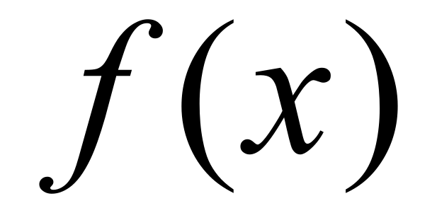

# Risolutore approssimativo di equazioni

Il progetto mira alla risoluzione approssimata di un'equazione in matematica mediante l'uso di algoritmi ricorsivi. Questo procedimento porta alla risoluzione di una equazione (non risolvibile per via algebrica) trovando un intervallo di soluzioni sempre più piccolo, che ad ogni iterazione si avvicina alla soluzione dell'equazione.
Il progetto utilizzerà i due metodi principali utilizzati per la risoluzione approssimata di un'equazione: il metodo di bisezione e il metodo delle tangenti di Newton

Per quanto riguarda il comparto tecnico, il progetto cercherà di seguire il pattern MVC (Model-view-container) e utilizzerà principalmente le classi.